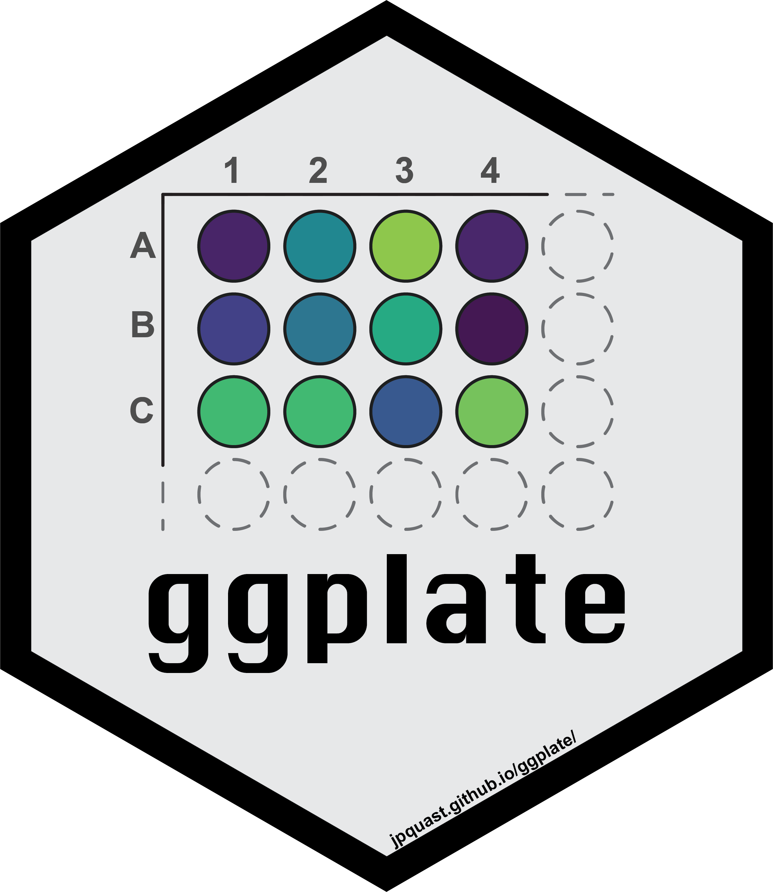

<!-- README.md is generated from README.Rmd. Please edit that file -->

```{r, include = FALSE}
knitr::opts_chunk$set(
  collapse = TRUE,
  comment = "#>",
  fig.path = "man/figures/README-",
  out.width = "100%"
)
```

# ggplate 

<!-- badges: start -->
[](https://CRAN.R-project.org/package=ggplate)
[](https://github.com/jpquast/ggplate/actions/workflows/R-CMD-check.yaml)
[](https://app.codecov.io/gh/jpquast/ggplate?branch=main)
[](https://app.codecov.io/gh/jpquast/ggplate)
<!-- badges: end -->

The goal of the **ggplate** package is to enable users to create simple plots of biological culture plates as well as microplates. Both continuous and discrete values can be plotted onto the plate layout. 

Currently the package supports the following plate sizes:

* 6-well plate
* 12-well plate
* 24-well plate
* 48-well plate
* 96-well plate
* 384-well plate
* 1536-well plate


## Installation

**ggplate** is implemented as an R package. 

You can install the release version from [CRAN](https://CRAN.R-project.org/package=ggplate) using the `install.packages()` function.

``` r
install.packages("ggplate")
```

You can install the development version from [GitHub](https://github.com/jpquast/ggplate) using the [`devtools`](https://github.com/r-lib/devtools) package by copying the following commands into R:

Note: If you do not have `devtools` installed make sure to do so by removing the comment sign (#).

``` r
# install.packages("devtools")
devtools::install_github("jpquast/ggplate")
```

In addition, you can install it via the command line through `conda` since it is also implemented as a [conda-forge package](https://anaconda.org/conda-forge/r-ggplate).

```
conda install -c conda-forge r-ggplate
```

## Usage

In order to use **ggplate** you have to load the package in your R environment by simply calling the `library()` function as shown bellow.

```{r load_package, message=FALSE, warning=FALSE}
# Load ggplate package
library(ggplate)
```

There are multiple example datasets provided that can be used to create plots of each plate type. You can access these datasets using the `data()` function.

```{r load_datasets}
# Load a dataset of continuous values for a 96-well plate
data(data_continuous_96)

# Check the structure of the dataset
str(data_continuous_96)
```

When calling the `str()` function you can see that the data frame of a continuous 96-well plate dataset only contains two columns. The `Value` column contains values associated with each of the plate wells, while the `well` column contains the corresponding well positions using a combination of **alphabetic row names** and **numeric column names**.

You can use this example data frame to create a 96-well plate layout plot using the `plate_plot()` function and setting the `plate_size` argument to `96`. There are currently two options for the plate well type. These can be either `"round"` or `"square"`. In the plot below we specify `"round"`, while `"square"` is the default value when the `plate_type` argument is not provided.

The data frame is provided to the `data` argument and the column name of the column containing the well positions is provided to the `position` argument. The column name of the column containing the values is provided to the `value` argument.

_Note: For an R markdown file set the chunk options to `dpi=300` for an optimal result._

```{r standard_plot, dpi=260, fig.width=7, fig.height=4}
# Create a 96-well plot with round wells
plate_plot(
  data = data_continuous_96,
  position = well,
  value = Value,
  plate_size = 96,
  plate_type = "round"
)
```

It is also possible to label each well in the plate with a corresponding label. For the plate above it would be interesting to display the exact value on each of the wells in addition to the colouring. For that we use the `label` argument which takes the name of the column containing the label as an input. In this example case this column is the same that is also provided to the `value` argument.

```{r standard_plot_labels, dpi=260, fig.width=7, fig.height=4}
# Create a 96-well plot with labels
plate_plot(
  data = data_continuous_96,
  position = well,
  value = Value,
  label = Value,
  plate_size = 96,
  plate_type = "round"
)
```

Try providing the `well` column to the `label` argument instead of the `Value` column. This will label each will with its position, which might make it easier to find specific positions.

```{r standard_plot_labels_wells, dpi=260, fig.width=7, fig.height=4}
# Create a 96-well plot with labels
plate_plot(
  data = data_continuous_96,
  position = well,
  value = Value,
  label = well,
  plate_size = 96,
  plate_type = "round"
)
```

### Legend Limit Adjustment

The legend for continuous values will only cover a range from the minimal measured to the maximal measured value. If the theoretically expected range of values is however bigger than the measured range you can adjust the legend limits. This can be done using the `limits` arguments. You provide a vector with the new minimum and maximum to the argument. Use NA to refer to the existing minimum or maximum if you only want to adjust one. Below we show this for an example dataset of a 384-well plate. 

```{r standard_plot_384_well_new_limits, dpi=260, fig.width=7, fig.height=4}
# Load a dataset of continuous values for a 384-well plate
data(data_continuous_384)

# Check the structure of the dataset
str(data_continuous_384)

# Create a 384-well plot with adjusted legend limits
plate_plot(
  data = data_continuous_384,
  position = well,
  value = Value,
  plate_size = 384,
  limits = c(0, 4)
)
```

If your new range will be smaller than the measured range, values outside of the range are coloured gray.

```{r standard_plot_384_well_new_limits_outlier, dpi=260, fig.width=7, fig.height=4}
# Create a 384-well plot with adjusted legend limits and outliers
plate_plot(
  data = data_continuous_384,
  position = well,
  value = Value,
  plate_size = 384,
  limits = c(0, 3)
)
```

### Gradient Colour Adjustment

When plotting continuous variables it is possible to to change the gradient colours by providing new colours to the `colour` argument. The colours will be used to create a new colour gradient for the plot. 

```{r standard_plot_384_well_new_gradient, dpi=260, fig.width=7, fig.height=4}
# Create a 384-well plot with a new colour gradient
plate_plot(
  data = data_continuous_384,
  position = well,
  value = Value,
  plate_size = 384,
  colour = c(
    "#000004FF",
    "#51127CFF",
    "#B63679FF",
    "#FB8861FF",
    "#FCFDBFFF"
  )
)
```

### Incomplete datasets

If you have a dataset that does not contain a value for each well, empty wells will be uncoloured. Empty wells can either contain `NA` as their `value` argument or they can be completely omitted from the input data frame.

```{r standard_plot_48_empty_wells, dpi=260, fig.width=7, fig.height=4}
# Load a continuous of discrete values for a 48-well plate
data(data_continuous_48_incomplete)

# Check the structure of the dataset
str(data_continuous_48_incomplete)

# Create a 48-well plot with adjusted legend limits
plate_plot(
  data = data_continuous_48_incomplete,
  position = well,
  value = Value,
  plate_type = "round",
  plate_size = 48
)
```

If you specifically want to keep `NA` values in your data you can set the `remove_na` argument to `FALSE`. You can also specifically control the fill colour of `NA` values with the `na_fill` argument.

## Plot Customisation

You can further customise your plot in various ways. Lets take a discrete 6-well plate dataset as an example. This dataset only contains three categories assigned to the six wells of the plate. This could be for example a pipetting scheme of an experiment.

You can change the title of the plot using the `title` argument. In addition the size of the title can be adjusted using the `title_size` argument.

_Note: Using the R markdown chunk options `out.width` and `fig.align` you can reduce the size of the figure in the R markdown document and align it for example to the center._

```{r standard_plot_6_well, dpi=260, fig.width=7, fig.height=4, out.width="80%", fig.align='center'}
# Load a dataset of discrete values for a 6-well plate
data(data_discrete_6)

# Check the structure of the dataset
str(data_discrete_6)

# Create a 6-well plot with new title
plate_plot(
  data = data_discrete_6,
  position = well,
  value = Condition,
  plate_size = 6,
  plate_type = "round",
  title = "Drug Treatment",
  title_size = 23
)
```

In addition it is possible to change the colours of the plot by providing new colours to the `colour` argument. As mentioned earlier this does not only work for discrete values but also for gradients that will be created based on the provided colours.

```{r 6_well_plot_new_colours, dpi=260, fig.width=7, fig.height=4, out.width="80%", fig.align='center'}
# Create a 6-well plot
plate_plot(
  data = data_discrete_6,
  position = well,
  value = Condition,
  plate_size = 6,
  plate_type = "round",
  title = "Drug Treatment",
  title_size = 23,
  colour = c("#3a1c71", "#d76d77", "#ffaf7b")
)
```

Also for this plot we can provide a column name to the `label` argument to directly label the wells in the plot. At the same time we can disable the legend setting the `show_legend` argument to `FALSE`. In this case the labels for each well are too large and we should also resize the label so that it fits perfectly into each well using the `label_size` argument.

```{r 6_well_plot_new_colours_no_legend, dpi=260, fig.width=7, fig.height=4, out.width="80%", fig.align='center'}
# Create a 6-well plot
plate_plot(
  data = data_discrete_6,
  position = well,
  value = Condition,
  label = Condition,
  plate_size = 6,
  plate_type = "round",
  title = "Drug Treatment",
  title_size = 23,
  colour = c("#3a1c71", "#d76d77", "#ffaf7b"),
  show_legend = FALSE,
  label_size = 4
)
```

## Potential Issues

In order to have the same proportions independent on the output screen and size, each plate plot is scaled according to the specific graphics device size. In order to see the currently used graphics device size and scaling factor the `silent` argument of the function can be set to `FALSE`. 

As you can see for the bellow example the graphics device size is `width: 7 height: 4` and the scaling factor is `1.256`. 

```{r return_device_size, dpi=260, fig.width=7, fig.height=4}
# Load a dataset of discrete values for a 24-well plate
data(data_discrete_24)

# Check the structure of the dataset
str(data_discrete_24)

# Create a 24-well plot
plate_plot(
  data = data_discrete_24,
  position = well,
  value = Condition,
  plate_size = 24,
  plate_type = "round",
  silent = FALSE
)
```

It is possible that the generated plot has overlapping or too spaced out wells. This can be corrected by resizing the output graphics device size until the plot has the desired proportions. If a specific output size is required and the plot does not have the desired proportions you can use the `scale` argument to adjust it as shown below. 

_Note: If you run the package directly in the command line, the function opens a new graphics device since it is not already opened like it would be the case in RStudio. If this is not desired you can avoid this by setting the `scale` argument._

```{r resize_plot, dpi=260, fig.width=7, fig.height=4}
# Create a 24-well plot
plate_plot(
  data = data_discrete_24,
  position = well,
  value = Condition,
  plate_size = 24,
  plate_type = "round",
  silent = FALSE,
  scale = 1.45
)
```

As you can see, however, now we are running into the problem that the legend is larger than the screen size. With the `legend_n_row` argument you can manually determine the number of rows that should be used for the legend. In this case it is ideal to split the legend into 2 columns by setting `legend_n_row` to 6 rows. In addition we should adjust the `scale` parameter to `1.2` in order to space out wells properly.

```{r 24_well_plate_legend_n_row, dpi=260, fig.width=7, fig.height=4}
# Create a 24-well plot with 2 row legend
plate_plot(
  data = data_discrete_24,
  position = well,
  value = Condition,
  plate_size = 24,
  plate_type = "round",
  silent = FALSE,
  scale = 1.2,
  legend_n_row = 6
)
```

If your dataset has a lot of labels it can become difficult to impossible to distinguish them just by colour as you can see for the dataset below.

```{r discrete_96_well_plate, dpi=260, fig.width=7, fig.height=4}
# Load a dataset of discrete values for a 96-well plate
data(data_discrete_96)

# Check the structure of the dataset
str(data_discrete_96)

# Create a 96-well plot
plate_plot(
  data = data_discrete_96,
  position = well,
  value = Compound,
  plate_size = 96,
  scale = 0.95,
  plate_type = "round"
)
```

This is an example where it is likely better to directly label wells instead of displaying a legend. 

```{r discrete_96_well_plate_label, dpi=260, fig.width=7, fig.height=4}
# Create a 96-well plot with labels
plate_plot(
  data = data_discrete_96,
  position = well,
  value = Compound,
  label = Compound_multiline, # using a column that contains line brakes for labeling
  plate_size = 96,
  show_legend = FALSE, # hiding legend
  label_size = 1.1, # setting label size
  plate_type = "round"
)
```

## Figure Export

Since the plot function checks the size of the graphics device in order to apply the appropriate scaling to the plot, it is important to first generate an output graphics device with the correct size. There are several functions that can accomplish this. These include e.g. `png()`, `pdf()`, `svg()` and many more.

```{r generate_graphics_device, eval=FALSE, message=TRUE, warning=TRUE}
# Generate a new graphics device with a defined size
png("plate_plot_384_well_plate.png", width = 10, height = 6, unit = "in", res = 300)

# Create a plot
plate_plot(
  data = data_continuous_384,
  position = well,
  value = Value,
  label = Value,
  plate_size = 384,
  colour = c(
    "#000004FF",
    "#51127CFF",
    "#B63679FF",
    "#FB8861FF",
    "#FCFDBFFF"
  )
)

# Close graphics device
dev.off()
```

